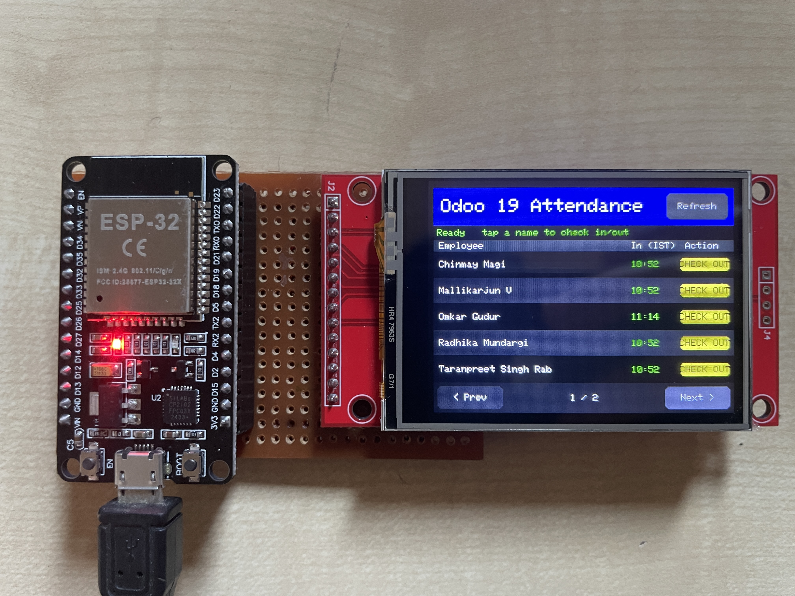
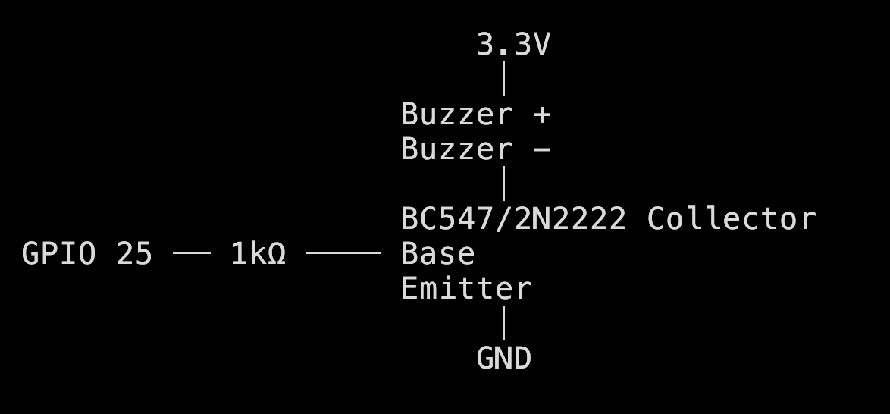
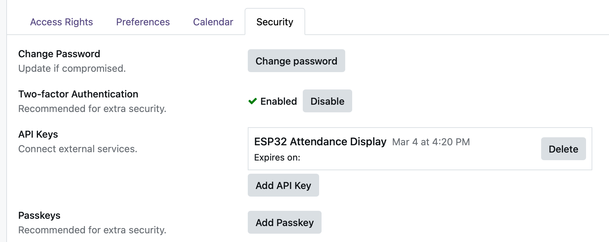
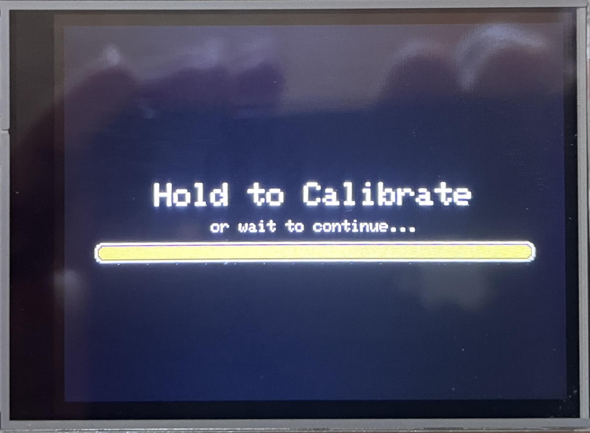
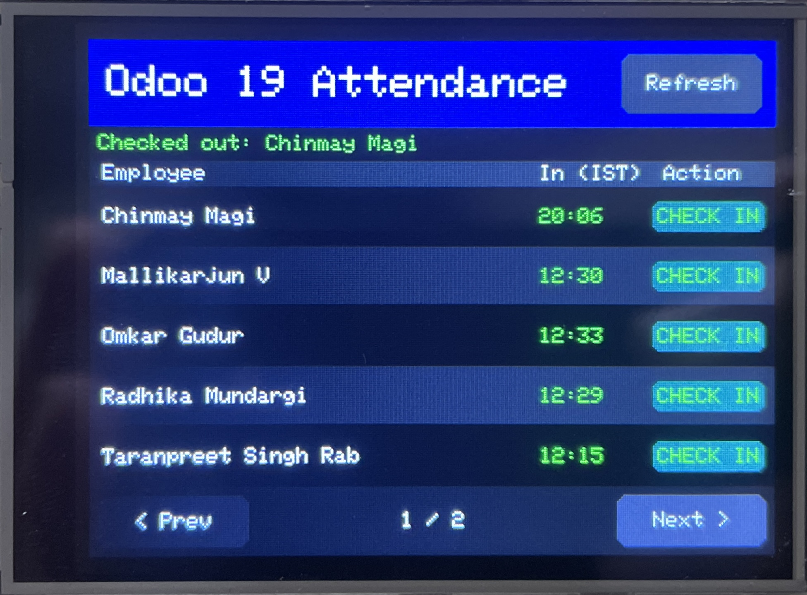

# Attendance Kiosk

ESP32-based touchscreen kiosk for Odoo 19 HR attendance — employees check in and out by tapping their name on screen.



---

## Table of Contents

1. [Hardware Required](#1-hardware-required)
2. [Wiring](#2-wiring)
3. [Software Dependencies](#3-software-dependencies)
4. [Odoo Setup](#4-odoo-setup)
5. [Configuration](#5-configuration)
6. [Build & Flash](#6-build--flash)
7. [Touch Calibration](#7-touch-calibration)
8. [Usage](#8-usage)

---

## 1. Hardware Required

| Component        | Details                                     |
| ---------------- | ------------------------------------------- |
| ESP32 DevKit     | ESP32-D0WD-V3, 38-pin                       |
| 2.4" TFT Display | ILI9341 driver, 320×240, with XPT2046 touch |
| Active Buzzer    | 3.3V, through-hole                          |
| Jumper wires     | Male-to-female                              |
| USB cable        | For flashing (CP2102 / CH340 based)         |

---

## 2. Wiring

### TFT Display + Touch

| Display Pin | ESP32 GPIO | Notes                        |
| ----------- | ---------- | ---------------------------- |
| VCC         | 3.3V       |                              |
| GND         | GND        |                              |
| SCK         | 18         | SPI clock, shared with touch |
| SDI / MOSI  | 23         | SPI data, shared with touch  |
| SDO / MISO  | 19         | SPI data, shared with touch  |
| DC          | 21         | Data/Command select          |
| CS          | 4          | TFT chip select              |
| RESET       | 22         | **Do not use GPIO 0**        |
| LED / BL    | 15         | Backlight                    |
| T_CS        | 5          | Touch chip select            |
| T_IRQ       | 36         | Touch interrupt (input only) |

### Buzzer

| Buzzer Pin      | ESP32 GPIO |
| --------------- | ---------- |
| + (longer leg)  | 25         |
| − (shorter leg) | GND        |



---

## 3. Software Dependencies

### Tools

| Tool               | Version                          |
| ------------------ | -------------------------------- |
| arduino-cli        | 1.2.2 or later                   |
| ESP32 Arduino core | `esp32:esp32` via Boards Manager |

Install ESP32 core:

```bash
arduino-cli core install esp32:esp32
```

### Libraries

| Library     | Version         |
| ----------- | --------------- |
| TFT_eSPI    | 2.5.43 or later |
| ArduinoJson | 7.4.2 or later  |

Install libraries:

```bash
arduino-cli lib install "TFT_eSPI"
arduino-cli lib install "ArduinoJson"
```

### TFT_eSPI User_Setup.h

After installing TFT_eSPI, edit `~/Arduino/libraries/TFT_eSPI/User_Setup.h` and set exactly these values (comment out everything else in those sections):

```cpp
#define ILI9341_DRIVER

#define TFT_MISO 19
#define TFT_MOSI 23
#define TFT_SCLK 18
#define TFT_CS    4
#define TFT_DC   21
#define TFT_RST  22
#define TFT_BL   15
#define TFT_BACKLIGHT_ON HIGH

#define TOUCH_CS 5

#define SPI_FREQUENCY     10000000
#define SPI_READ_FREQUENCY 6000000
```

---

## 4. Odoo Setup

**Supported version:** Odoo 19.0

### Generate an API Key

1. Log in to Odoo as an administrator
2. Go to **Settings → Users & Companies → Users**
3. Open your user profile
4. Under **API Keys**, click **New API Key**
5. Give it a name (e.g. `kiosk`) and copy the generated key



The key is only shown once — save it immediately.

---

## 5. Configuration

Open `attendance_display/attendance_display.ino` and update these defines at the top:

```cpp
#define WIFI_SSID      "your_wifi_name"
#define WIFI_PASSWORD  "your_wifi_password"
#define ODOO_HOST      "192.168.x.x"     // Odoo server IP on local network
#define ODOO_PORT      8069
#define ODOO_APIKEY    "your_api_key_here"
```

`ODOO_HOST` must be the local IP of the machine running Odoo — not a domain name unless DNS is configured on the same network.

---

## 6. Build & Flash

### Compile

```bash
arduino-cli compile --fqbn esp32:esp32:esp32 attendance_display --build-path /tmp/attendance_build
```

### Upload

Close any Serial Monitor first, then:

```bash
arduino-cli upload --fqbn esp32:esp32:esp32 -p /dev/cu.SLAB_USBtoUART attendance_display --input-dir /tmp/attendance_build
```

Replace `/dev/cu.SLAB_USBtoUART` with your actual port. To find it:

```bash
arduino-cli board list
```

---

## 7. Touch Calibration

Calibration must be run once after first flash, and again any time the display rotation changes.

1. Power on the device
2. When the **"Hold to Calibrate"** screen appears, touch and hold anywhere on the screen
3. Tap each corner marker precisely when prompted
4. Calibration is saved to NVS — subsequent boots skip this step automatically

To recalibrate: touch and hold during the 3-second countdown at boot.



---

## 8. Usage

On boot the kiosk fetches all active employees from Odoo and today's attendance records.



### Check In / Check Out

- Tap an employee row to **check in** — a new attendance record is created in Odoo
- Tap again to **check out** — the record is updated with the checkout time
- Times are stored in UTC in Odoo and displayed in IST on the kiosk

### Pagination

- Use **< Prev** and **Next >** buttons to navigate pages (5 employees per page)

### Refresh

- Tap **Refresh** in the header to re-fetch all data from Odoo

### Buzzer Patterns

| Event      | Pattern       |
| ---------- | ------------- |
| Boot ready | 1 short beep  |
| Check-in   | 2 short beeps |
| Check-out  | 1 long beep   |

---

## Folder Structure

```
attendance_system/
├── attendance_display/
│   └── attendance_display.ino   # Main sketch
├── tft_test/
│   └── tft_test.ino             # Standalone display diagnostic
└── README.md
screenshots
```
